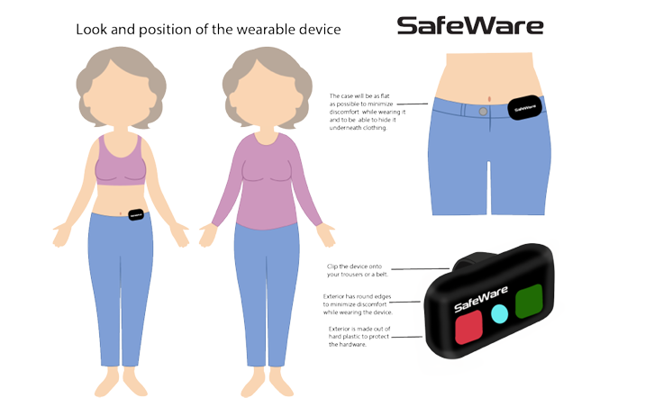
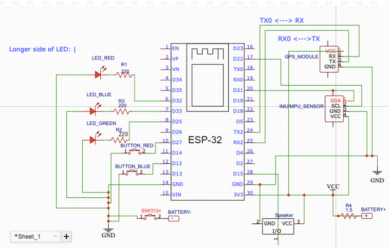

# SafeWare  
## Wearable Fall Detection System for Independent Elderly Living

SafeWare is a wearable fall detection device developed in response to a growing demographic and healthcare challenge.

By 2030, the number of people aged 75+ in the Netherlands is expected to increase significantly. At the same time, home-care services are under increasing pressure due to rising demand and healthcare costs. Many elderly individuals prefer to live independently, but falls remain one of the primary risks threatening safety and autonomy.

SafeWare was developed to support independent living by providing:

- Automatic fall detection  
- Immediate local feedback  
- User override in case of false alarms  
- GPS-based location retrieval  
- Emergency communication capability  

This project was developed at Eindhoven University of Technology as part of the USE Learning Line IoT course (5USUA0 – Concept vs Reality, 2022–2023).

---

# Device Overview

## Wearable Design

The device is waist-mounted and designed to be minimal, intuitive, and non-intrusive.

User interaction is intentionally simple:

- **Red Button** — “I need help”
- **Blue Button** — “I don’t need help”
- **Green LED** — Device powered
- **Red LED + Buzzer** — Emergency state

The physical interface was designed to ensure clarity, reduce cognitive load, and preserve user autonomy.

---

# Hardware Architecture 

The system consists of five integrated hardware modules:

## Core Microcontroller
- **ESP32 (CP2102)**  
Responsible for processing, control logic, and communication.

## Motion Sensing
- **MPU-6050 (3-axis accelerometer + gyroscope)**  
Provides acceleration and angular velocity data for fall detection.

## Location Tracking
- **GY-NEO6MV2 GPS Module**  
Retrieves latitude and longitude coordinates after confirmed fall.

## User Interaction
- 2 tactile push buttons  
- 3 LEDs (Green, Blue, Red)  
- Active 5V buzzer  

## Power System
- 18650 Li-ion rechargeable battery  

Component selection was based on:

- Affordability  
- Availability  
- Compatibility  
- Power efficiency  
- Ease of integration  

The architecture was structured modularly to separate sensing, decision-making, user feedback, and positioning.

---

# Fall Detection Logic

SafeWare implements a three-trigger detection algorithm:

1. Lower acceleration threshold breach  
2. Upper acceleration threshold breach  
3. Significant change in angular orientation  

After all triggers activate:

- Orientation stability is verified  
- `fall_detected` is set to true  
- A 15-second cancellation window begins  
- If not cancelled:
  - GPS coordinates are retrieved  
  - Emergency state is maintained  

This trigger-based system reduces false positives while maintaining responsiveness.

---

# Firmware
SafeWare/
└── SafeWare.ino

The firmware includes:

- IMU initialization and calibration  
- Real-time motion vector calculation  
- Trigger-based fall detection  
- Button state management and override logic  
- LED state control  
- Buzzer activation  
- GPS data parsing  
- Timed emergency window handling  

The hardware and firmware were designed together to ensure that sensing thresholds, trigger timing, and user interaction logic worked coherently within real-world constraints.

---

# Engineering Decisions

Key hardware and software decisions included:

- Using a trigger-based algorithm instead of single-threshold detection to reduce false alarms  
- Including a manual override window to preserve user control  
- Choosing ESP32 for integrated WiFi capability and processing power  
- Designing modular hardware separation for clarity and debugging  
- Prioritizing outdoor GPS tracking as a first implementation focus  

The system reflects iterative testing, calibration, and refinement of both hardware configuration and embedded logic.

---

# Team & Acknowledgment

SafeWare was developed collaboratively by:

- Anca Iordanescu – Computer Science  
- Jimena Botella Baena – Applied Mathematics  
- Femke Veenvliet – Industrial Design  
- Muhammad Umer – Electrical Engineering  

Muhammad Umer was responsible for:

- Hardware architecture design  
- Component integration  
- Circuit implementation  
- Embedded firmware development  
- Fall detection algorithm implementation  
- System-level hardware-software integration  

This repository specifically contains the firmware component of the SafeWare prototype.

---

# Disclaimer

SafeWare is an academic prototype developed for educational purposes and is not a certified medical device.
